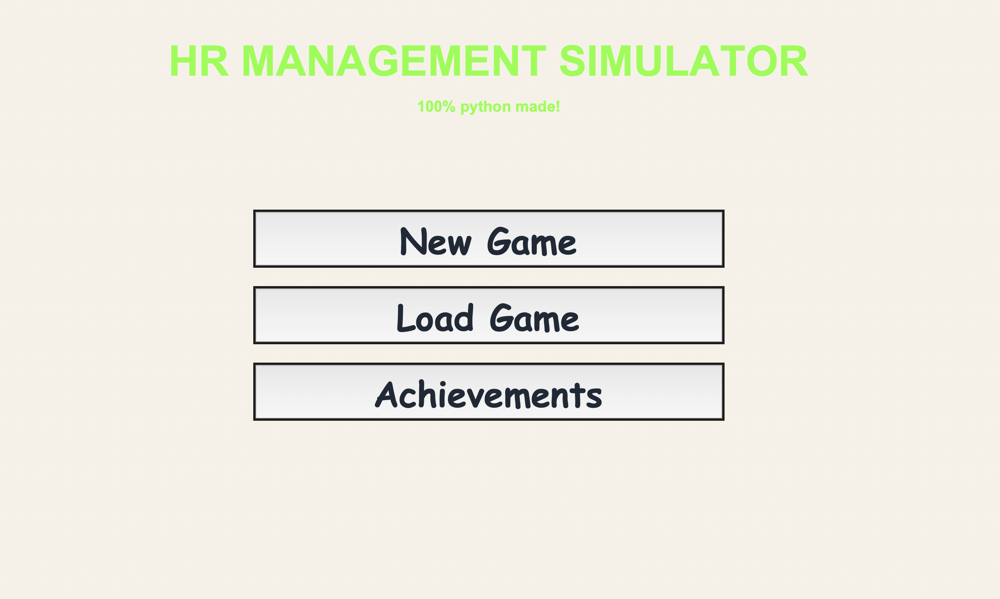

# 🏢 HR Management Simulator

A strategy-based management game built with Python and Tkinter where you run a company, manage employees, handle orders, and grow your market share to dominate the industry.

---

## 🎮 Features

- 📊 Real-time company simulation
- 👥 Employee and morale management
- 📦 Dynamic order system (max 3 active orders)
- 📉 Risk/reward decisions with success rates
- ⚡ Money-per-second system
- 🎯 Difficulty levels (Easy, Normal, Hard)
- 🎨 Custom UI with dark theme
- 📜 Random events that affect gameplay

---

## 🖼️ Demo



---

## 🧠 Gameplay Overview

- Earn money over time based on your company performance
- Accept or decline orders to grow faster (with risks)
- Manage:
  - Morale
  - Productivity
  - Reputation
  - Market Share (capped at 100%)
- Lose employees if morale gets too low
- Win by reaching your target money based on difficulty

---

## ⚙️ Controls

- Click buttons to make decisions
- Scroll to view all content
- Choose:
  - Company
  - Leadership style
  - Difficulty

---

## 🧩 How to Run

```bash
python manager_sim.py
